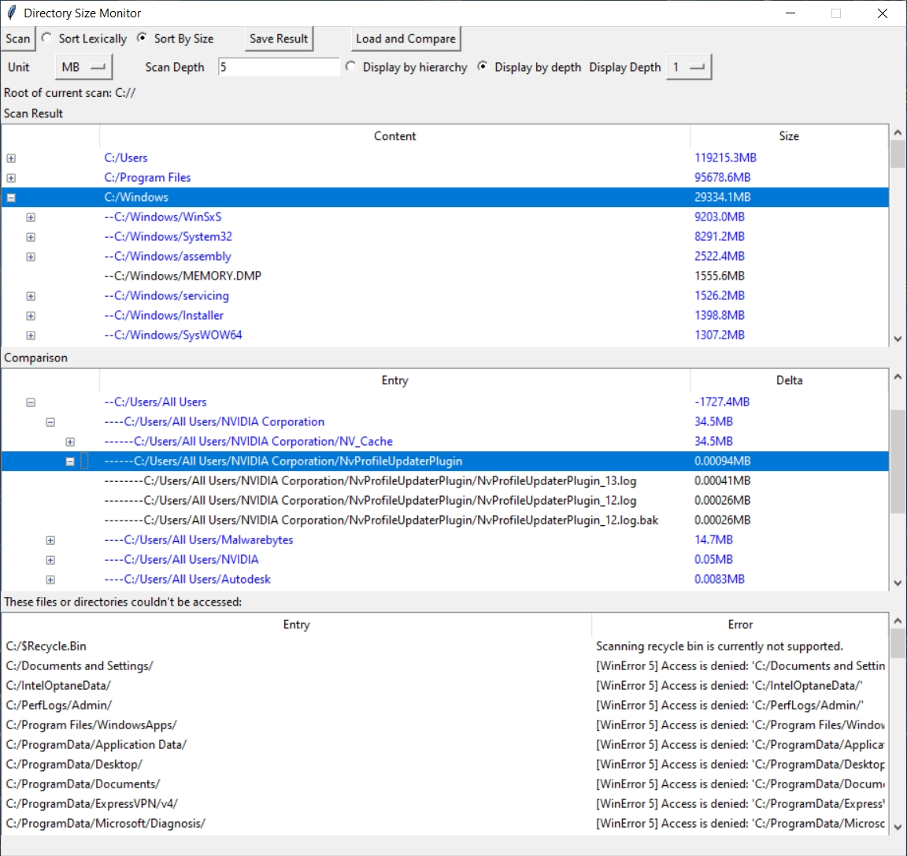

# Directory Size Monitor

# Intro
Directory Size Monitor is a tool that can show the user what are some biggest files and directories on the file system, as well as some biggest size changes of files and directories over a period of time.

# Installation
Simply download the [latest release](https://github.com/FreemanMakesGames/DirectorySizeMonitor/releases).
Currently there is only Windows version. It may be a good idea to put it into `C:\Program Files\DirectorySizeMonitor`, and create a desktop shortcut to `DirectorySizeMonitor.exe`.

# Usage
Typical use of this tool starts with these steps:
1. Click the "Scan" button at the top-left.
2. Select the "target directory" you want to scan.
3. Sort by size.

Now you will be shown the files and directories under your target directory, sorted from big to small.

This was the original motivation for the project. In Windows's file explorer, directory sizes are hidden. It's really hard to get an overview, or to find out which directory or file takes up the most space. Directory Size Monitor helps with this problem.

## Scan Depth
You can enter the depth for a scan. With each added depth, the directories will be further opened up, and have their contents scanned.

## Display Depth
You can display by hierarchy, which resembles how the file system is usually displayed by OS. Or you can display by depth. Various depths give various granularities. For a hypothetical example, if you scan the C drive with a depth of 5, but display the result with a depth of 1, it'll show that `C:/dir1` is the biggest entry. But if you display with a depth of 2, `C:/dir1` and other directories will be broken up. Maybe now `C:/dir5/file1` is the biggest entry, and nothing from `C:/dir1` ranks high, because `C:/dir1` consists of a lot of small files.

You'll need to click "Re-display" to display at a different depth.

## Monitoring size changes over time
Directory Size Monitor's second feature is examining size changes of files and directories under the target directory you selected. Before you start, remember that comparison can only be made between scans under the same target directory, with a same depth. Now, to use this feature:
1. Scan a target directory with a desired depth.
2. Click "Save Result", which will prompt you to save into a JSON file.
3. After a period of time, scan the same target directory again, with the same depth.
4. Click "Load and Compare", and load the file you saved last time.
The tool will then show you the size changes of files and directories since last time, as well as new and deleted entries.

# Notes
1. It can take some time to scan a large directory. The program may appear frozen. Simply wait until it's finished.
2. If you save the scan result inside the directory you are scanning, the result itself will be reflected when you scan and compare later! An example of this happening is if you scan the C drive, and save the result inside C drive.
3. The program hasn't been benchmarked. Just for reference, it took 6 minutes for my gaming laptop from 2015 to scan its 128GB C drive.

# Errors
Errors will be reported in the view at the bottom. Currently on Windows, there are 2 known errors: `WinError 5` and `WinError 1920`. Both are related to permission. Some of them can be solved by running the program as administartor. But lots of them cannot. These are probably files or directories that can be accessed only by the "system".

# Use cases
There are some use case examples in the wiki [here](https://github.com/FreemanMakesGames/DirectorySizeMonitor/wiki/Use-cases).

# Current Limitations
1. Due to Python's GIL, performance can't be improved with multithreading. Scanning a large directory can take some minutes.
2. Re-displaying the results will always re-insert all entries into the views. This can be slow and take up to a few seconds, for scan results of large directories.
3. Saved scan result can be huge. Saving can be slow.
4. Scanning the recycle bin on Windows isn't supported.

# Why not just use WinDirStat
WinDirStat was my initial consideration, when I needed to analyze the sizes of files and directories on my hard drive. However, the source code and download repositories of WinDirStat were so poorly maintained. [People got hacked](https://www.reddit.com/r/sysadmin/comments/4vx839/fosshub_compromised_with_malware_dont_download/) when downloading WinDirStat.
